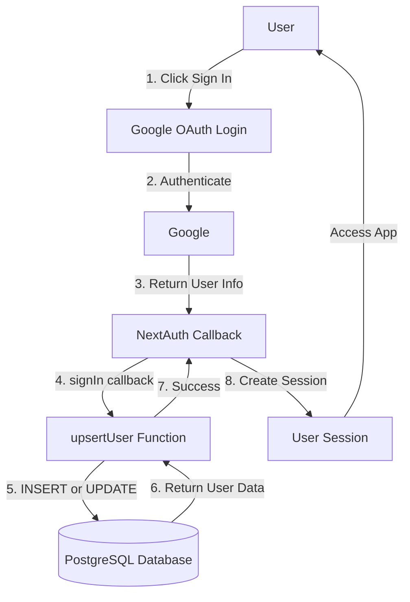
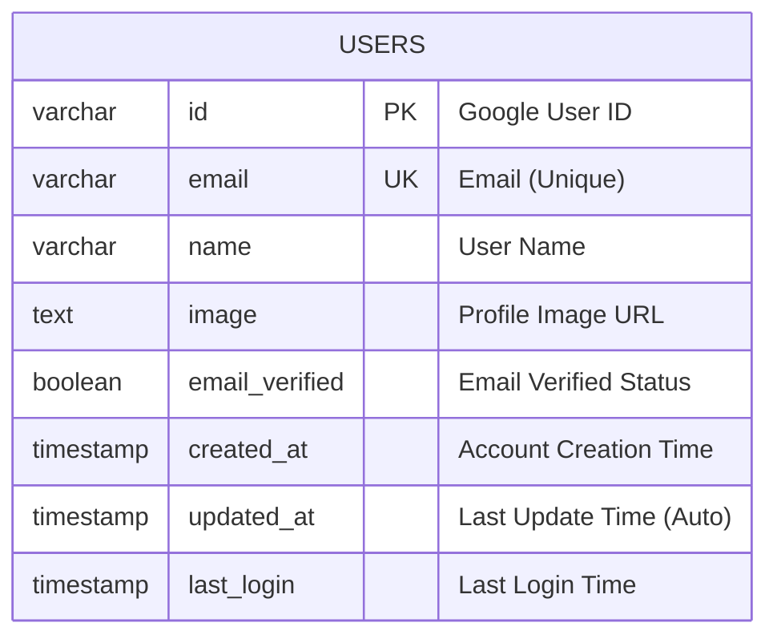
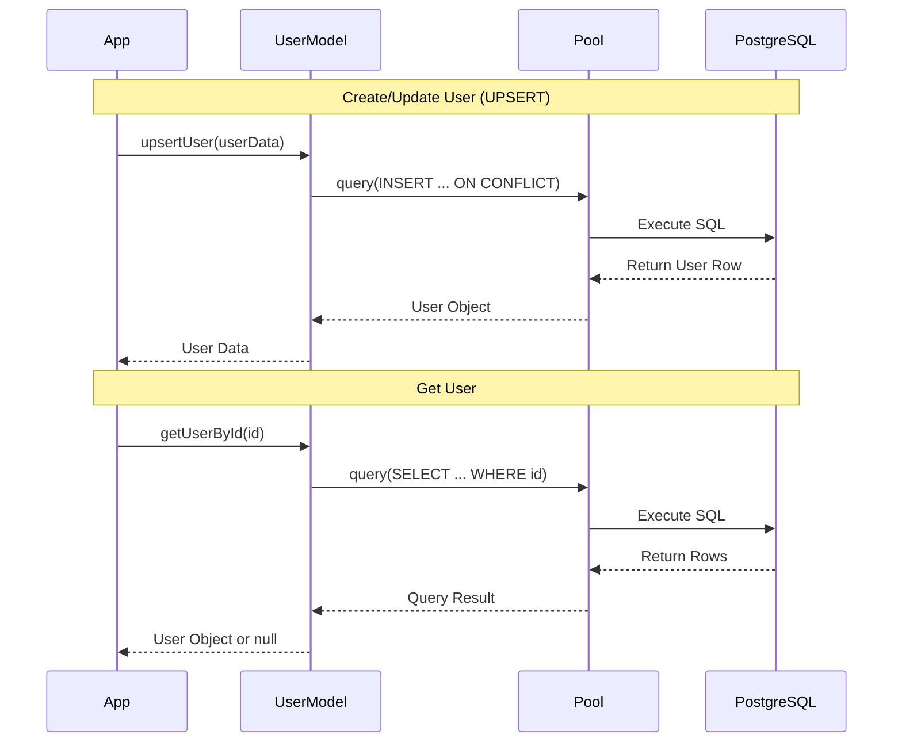

# System Architecture

## User Authentication & Data Flow



## Database Structure



## File Organization

```
rarity-runner/
├── auth.ts                          # ✅ Updated - Auto-save user on login
├── lib/db/
│   ├── db.ts                       # ✅ Updated - Export pool
│   ├── schema/
│   │   └── users.sql              # ✅ New - Table schema
│   ├── models/
│   │   └── user.ts                # ✅ New - User CRUD functions
│   ├── migrate.ts                 # ✅ New - Migration script
│   ├── test-user-model.ts         # ✅ New - Test script
│   └── README.md                  # ✅ Updated - User docs
└── .env.local                      # Database credentials
```

## CRUD Operations Flow


